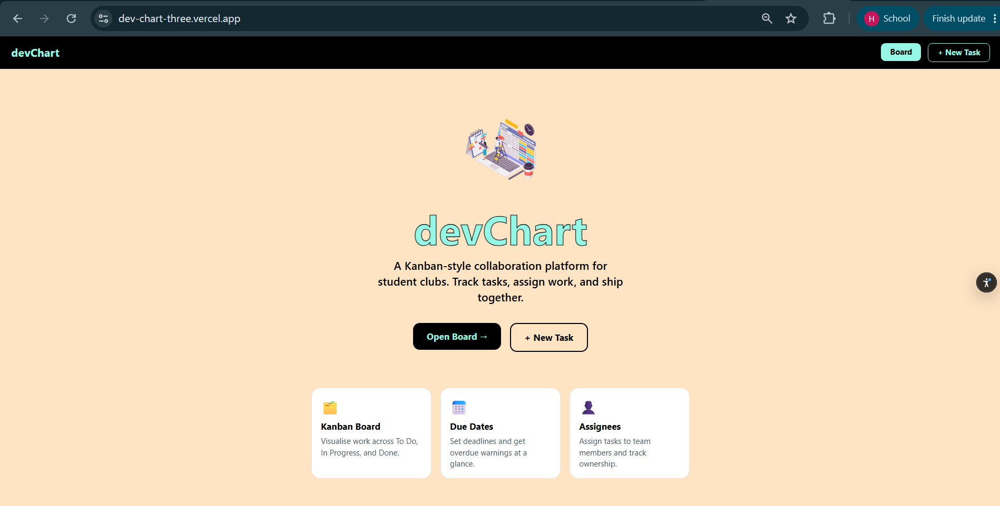
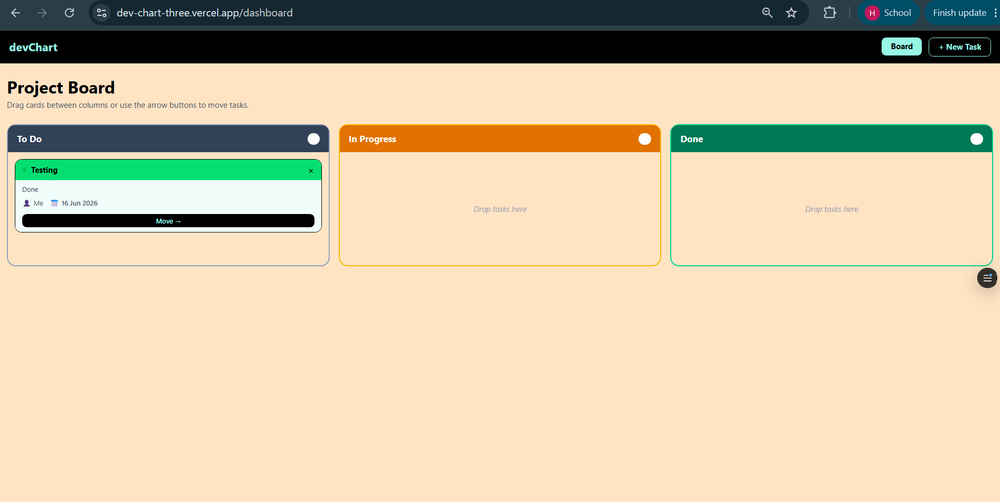
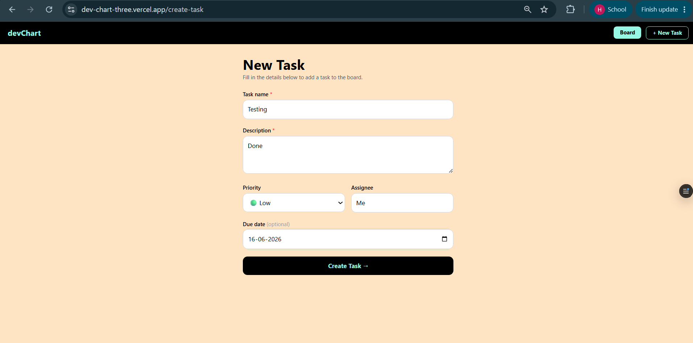
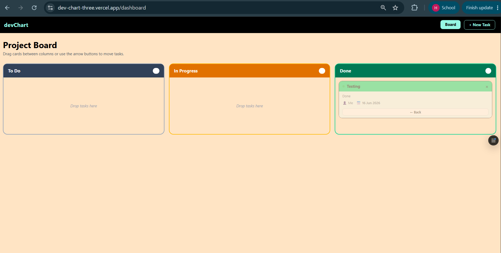

# devChart — Club Collaboration Platform

A Kanban-style project management tool built for student clubs. The idea was to take a basic task tracker and turn it into something actually useful for teams — where you can see who's working on what, when things are due, and move work across stages without friction.

Live demo: [dev-chart-three.vercel.app](https://dev-chart-three.vercel.app)

---

## Features

### Core
- **Kanban Board** — Three-column layout: To Do, In Progress, and Done
- **Drag and Drop** — Drag cards between columns to update status instantly
- **Move Buttons** — "← Back" and "Move →" buttons on each card for keyboard/mobile users

### Additional
- **Due Dates** — Set deadlines on tasks; overdue ones show a ⚠️ warning automatically
- **Assignees** — Assign tasks to team members by name, shown on the card
- **Task Deletion** — Remove tasks with the × button directly from the board

---

## Screenshots

### Home Page


### Kanban Board


### Create Task Form


### Move Task


---

## Tech Stack

| Layer      | Technology                 |
|------------|----------------------------|
| Framework  | Next.js 16 (App Router)    |
| Language   | TypeScript                 |
| Database   | MongoDB Atlas via Mongoose |
| Styling    | Tailwind CSS v4            |
| Deployment | Vercel                     |

---

## Setup Instructions

### Prerequisites
- Node.js 18+
- A [MongoDB Atlas](https://www.mongodb.com/atlas) account 

### 1. Fork & Clone

```bash
git clone https://github.com/himanshudalmia/devChart.git
cd devChart
npm install
```

### 2. Environment Variables

Create a `.env.local` file in the root folder:

```env
MONGODB_URI=mongodb+srv://<username>:<password>@<cluster>.mongodb.net/?retryWrites=true&w=majority
```

Get your connection string from MongoDB Atlas → Connect → Drivers.

### 3. Run Locally

```bash
npm run dev
```

Open [http://localhost:3000](http://localhost:3000).

---

## Deployment (Vercel)

1. Push your fork to GitHub
2. Go to [vercel.com](https://vercel.com) → New Project → import the repo
3. Add `MONGODB_URI` as an environment variable in project settings
4. Hit Deploy — Vercel handles everything else automatically

---

## API Routes

| Method | Route             | Description       |
|--------|-------------------|-------------------|
| GET    | `/api/tasks`      | Fetch all tasks   |
| POST   | `/api/tasks`      | Create a task     |
| PATCH  | `/api/tasks/[id]` | Update task       |
| DELETE | `/api/tasks/[id]` | Delete a task     |

---

## Project Structure

```
src/
├── app/
│   ├── api/tasks/
│   │   ├── route.ts           # GET, POST
│   │   └── [id]/route.ts      # PATCH, DELETE
│   ├── dashboard/page.tsx     # Kanban board
│   ├── create-task/page.tsx   # New task form
│   └── page.tsx               # Landing page
├── components/
│   └── Navbar.tsx
├── lib/
│   └── mongodb.ts
└── models/
    └── Tasks.ts
```

---

## Known Limitations

- No authentication — anyone with the URL can create or delete tasks
- No real-time sync between users (need to refresh to see others' changes)
- Single shared board — no support for multiple projects or teams yet
- Assignees are plain text, not linked to actual user accounts
